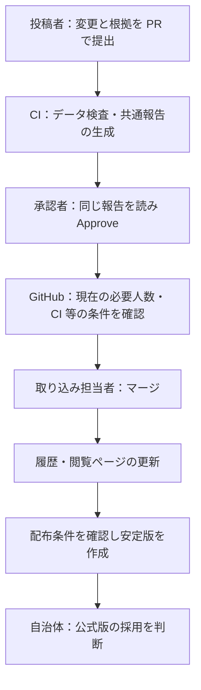

<!-- Copyright (c) 2026 4dcitygml -->
<!-- SPDX-License-Identifier: Apache-2.0 -->

# 自治体職員のための処理フロー：提案から承認・公式版まで

**承認者は、共通の CI 報告と比較表示を確認し、GitHub の Approve で採用判断を記録します。** 委託先・職員・上長が同じ仕組みを使います。運用者だけの確認ボタンや、固定された二段階の承認手順はありません。

CI は投稿・更新をきっかけに、データ検査、修正依頼、変更／根拠／検査／影響／推奨の報告を自動生成します。人が検査を肩代わりしたり、報告を書き直したりする必要はありません。

> 導入準備中の文書です。対応 tools Release・都市側 pin 更新・GitHub と画面の実機確認を終えてから運用を開始します。住民が使うハブ（hub-v1.3 系）にはこの報告ゲートは含まれません。

## 1. 誰が何を判断するか

| 担当 | 役割 |
|---|---|
| 投稿者 | 変更内容と根拠を提出する。自分の PR は自分では承認できない |
| CI | 機械検査と共通報告の生成を担当する |
| 承認者（レビュアー） | 共通報告と比較表示を読み、採用してよいか判断する。委託先・職員などが参加する |
| リポジトリ管理者 | 権限、必要承認数、保護設定を管理する |
| 運用担当者 | ツール保守・問い合わせ・マージ・配布等を担当する。承認者を兼ねてもよい |

運用と承認を同じアカウントで兼任できます。一つのアカウントは一人分の承認です。機械は根拠の十分性や現実の建物との対応まで保証しないため、それらは人が判断します。

## 2. 運用を始める前：合意・開設・引き継ぎ

対象データ、出典、利用条件、公開名義、窓口、承認者、必要人数、引き継ぎ条件を決めます。初期データと来歴を記録し、PR 必須・必要な承認・必須 CI チェック等を設定します。

開設時は正常系だけでなく、検査不合格、報告なし・古い報告、承認人数不足がマージを阻止することも確認します。初回試験の投稿者と承認者を分け、不正な試験データは取り込みません。

## 3. 日常の流れ：投稿からマージまで

不合格なら CI が修正項目を案内し、投稿者が修正すると再検査・報告生成が動きます。人が不備を見つけた場合は Request changes と理由を記録します。

Draft は投稿者が作業中であることを示す状態です。Draft 中も CI は動きます。作業が整ったら投稿者が Ready にします。編集ツールは通常の PR を作成します。報告確認を条件とする自動 Draft／Ready 切り替えは行いません。

## 4. 承認人数と一覧の絞り込み

**必要な承認人数は、自治体が運用体制に合わせて随時変更できます。** 権限を持つ管理者が変更し、変更日・変更前後の人数・理由を記録します。審査中の PR も現在の設定で扱う前提です。

必要人数は、その時点で承認に参加する予定の人数を基本にします。PR 作成者は除きます。承認権限を持つ全アカウントを、毎回の承認参加者と同一視する必要はありません。不在時や契約切り替え時には担当と人数を見直します。

hub の「残り承認数で絞り込む」で、「すべて」「残り 2 人」「残り 1 人」等を選べます。人数を指定すると、検査が完了した PR のうち条件に合うものを表示します。例えば必要数 4 人なら、受託者 2 人が承認した後の担当職員は「残り 2 人」、上長は「残り 1 人」を選べます。

設定はこのブラウザ内でアカウント・リポジトリごとに保存し、他の人に影響しません。一覧を更新すると新しい承認と GitHub の人数設定を取得します。設定変更で対象がなくなった場合は、絞り込みを選び直せます。

この絞り込みは表示の工夫であり、担当者や順序を強制しません。「2 人必要」だけで「担当者と上長が一人ずつ」を保証するものではありません。特定チームの承認を必須にする場合は、自治体が Code Owners 等の条件を別に設定します。

## 5. CI・承認記録・マージの関係

| 条件 | 確認する内容 |
|---|---|
| `analyze` | データ形式、対象、参照、図形等の機械検査。実運用では CITYGML_STRICT_GATE=1 が必須 |
| `ci-report` | 現在の提案・検査実行に対応する自動報告が生成・配信されているか |
| GitHub の承認ルール | 現在の必要人数、承認権限、設定された Code Owners・最新 push・承認失効等の条件 |

同じ人の重複承認、取り消された承認、承認数に算入されない権限のレビューは数に含めません。設定やレビューの取得に失敗した場合は「承認数を取得できません」と表示し、「すべて」から確認できます。

**「残り 0 人」は人数条件に達したという意味です。マージ可能とは限りません。** CI、差し戻し、会話解決、特定チーム等の条件も GitHub が確認します。

提案の更新で CI 報告は再生成されます。人の承認が失効するかは GitHub の設定に従います。CI 再実行だけを理由とする独自の承認取り消しは行いません。自動処理は非同期なので、最新結果を確認してください。

## 6. 承認した後：履歴・安定版・公式版

**承認、マージ、安定版の配布、自治体による公式版の採用は、それぞれ別の段階です。**

| 段階 | 何が変わるか | 何を確認するか |
|---|---|---|
| 承認 | 職員の採用判断が PR に記録される | この時点ではデータはまだ取り込まれていない |
| マージ | 変更がリポジトリの `main` に入り、建物ごとの履歴に残る | 必須チェックと有効な承認が揃っている |
| 閲覧・履歴更新 | マージをきっかけに履歴索引と閲覧用ページの更新処理が動く | 運用者が処理の成功を確認する。マージと同時に完了するとは限らない |
| 安定版の配布（Release） | 選んだコミットのデータを、利用者向けの版として配布する | 対象範囲、出典、保留事項、検査結果、配布物とコミットの対応を運用者が確認する |
| 公式版の採用 | 自治体がその出力を公式版として採用する | 採用した版・日付・公表先を記録する |

マージされても、既に配布している安定版は自動では差し替わりません。公開リポジトリの `main` や閲覧用ページで更新内容が見えることと、安定版・公式版が更新されることは区別します。通常の利用者には、採用した安定版を案内します。

配布の頻度、版の命名、初回の安定版を出す条件は、運用開始までに別途確定します。最終的な配布検査には未実装の項目があるため、すべての年度更新や公式版出力が既に自動化されているわけではありません。

マージ後に誤りが見つかった場合は、運用者が取り消しまたは訂正の PR を作ります。既に配布した版への影響と、修正版を出す必要も確認します。通常は履歴を書き換えず、訂正の理由と経緯を残します。緊急時の保護ルールの例外は自治体の管理者が判断し、理由を記録します。

## 7. 継続運用と引き継ぎ

hub は、投稿者の修正待ち・自動処理中・処理障害・承認待ち・必要人数到達を分けます。運用者は、長く止まっているものの次の対応を決めます。自治体の承認者が不在の場合は、指定した別の承認者へ引き継ぎます。承認者がいないことを、検査成功だけで代替はしません。

自治体の管理者は、異動や契約終了時にチームの所属と権限を更新します。委託先が交代しても、自治体が承認者と必要人数を決め、各承認者が同じ報告を確認する方針を維持します。

詳細な契約は [PR 運用手順（最新英語版）](../pr-operations.md)、職員の操作は [承認者ガイド（英語）](../approver-guide.md)、自動報告の確認・マージ・配布作業は [運用者ハンドブック（英語）](../operator-handbook.md) を参照してください。

## 建て替え・分割・統合の提案

建て替え・分割・統合は「1 事象＝1 PR」とし、旧建物と新建物の複数 ID をまとめて扱います。例えば旧 A・B を削除して新 C に建て替える提案を、無関係な三件の訂正に分けません。通常の属性訂正は引き続き 1 建物単位です。

投稿者は、事象 ID・種類・旧／新 ID・理由・根拠確認日・根拠資料を一つの事象記録にします。CI は記録のハッシュ、追加／削除／変更の区分、実際の変更との一致、対象外建物の変更、ID の重複、複数記録・コミットの混在を検査します。確認日は採用承認日とは別です。

自動報告にも旧→新の対応と根拠を載せます。CI が保証するのは記録とデータの整合性です。「実際に一つの建て替え・分割・統合なのか」「この根拠でよいか」は、職員が同じ報告と比較表示を見て判断します。根拠不明の対応を、ID 数だけで確定しません。

専用検査はローカル実装済みですが、対応 Release・都市側 pin 更新と試験 PR による実機確認が必要です。現在の編集画面には、建て替え用の入力機能はありません。詳細は [事象記録の仕様と例](https://github.com/4dcitygml/tools/blob/main/docs/lifecycle-events.md)を参照してください。

## 共通処理の改善と相談

都市だけでは解決できない処理・検査の問題は、[4dcitygmlの相談窓口](https://github.com/4dcitygml/tools/issues/new?template=tooling_consultation.yml)へ相談できます。既存のIssue・PRがあればリンクし、共通化のために別の報告書を作り直す必要はありません。

LOD0のFootPrintをRoofEdgeへ意味修正する処理は、限定した版・条件での試験段階です。座標を変えなくても意味が変わるため、原典の根拠と適用条件の確認が必要です。対応tools Releaseと都市CIの版を揃え、試験を完了してから利用します。相談フォームへの投稿だけで処理やPR作成が自動実行される段階ではありません。

[処理の仕様（英語）](https://github.com/4dcitygml/tools/blob/main/docs/lod0-semantic-correction.md)と[基本的な考え方](https://github.com/4dcitygml/tools/blob/main/docs/ja/principles.md)を参照してください。
